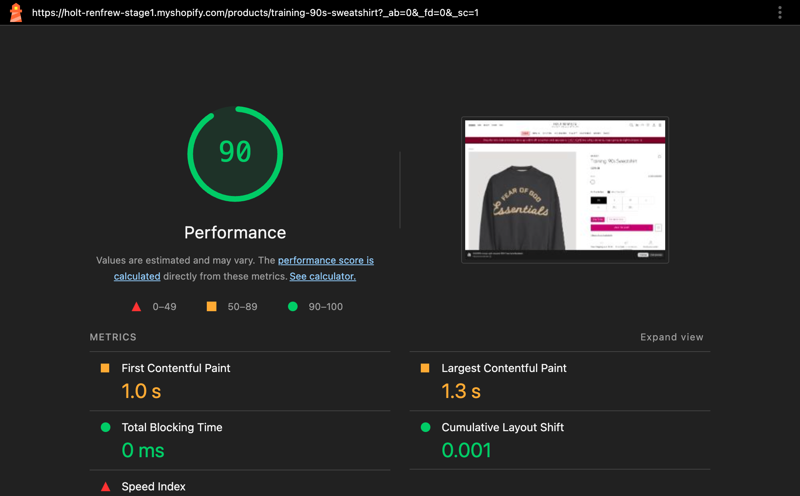
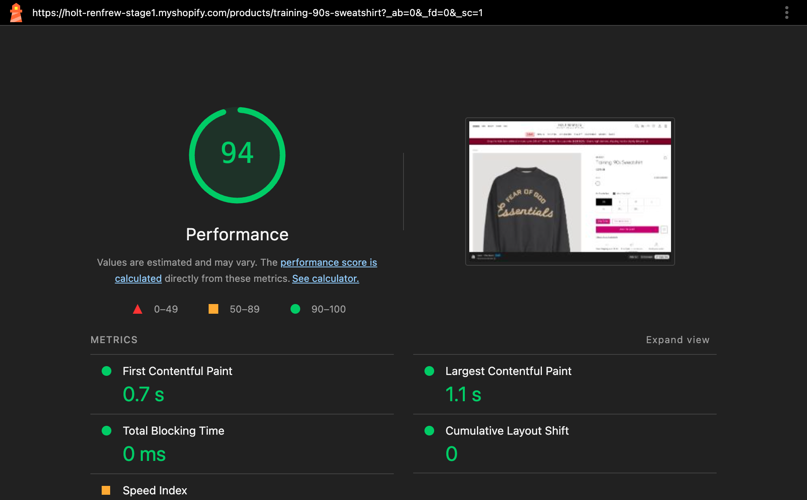

# vite-plugin-shopify-inline-styles

[](https://www.npmjs.com/package/vite-plugin-shopify-inline-styles)
[](https://github.com/cesareuseche/vite-shopify-styles-plugin/actions/workflows/ci.yml)

Renders each Shopify section/snippet's built CSS as an inline `<style>` tag instead of a
render-blocking `<link>`, using Shopify's server-side
[`inline_asset_content`](https://shopify.dev/docs/api/liquid/filters/inline_asset_content) filter.
Companion to [`vite-plugin-shopify`](https://github.com/barrel/shopify-vite).

## Why

Per-component CSS `<link>` tags live in the page body; the browser discovers each one late and
blocks paint on a CDN round trip. Inlining puts the minified CSS directly in the HTML stream:
zero extra requests, no FOUC, faster FCP/LCP.

**Trade-off:** inlined CSS is not browser-cached across page views. For components rendered many
times per page (product cards in a grid) inlining would also duplicate the CSS once per render —
Liquid's `` is sandboxed, so no dedup is possible. Use `linkEntries` for those: they
keep a classic cached `<link>` to the same built asset.

## Real-world results

A production Shopify theme (44 component CSS entrypoints) measured with and without this
plugin — the two theme versions differ only by the migration from `<link>` tags to
`render 'vite-style'`:

| Page       | Render-blocking stylesheets | Stylesheet requests | FCP               | LCP             |
| ---------- | --------------------------- | ------------------- | ----------------- | --------------- |
| Home       | 6 → **3**                   | 20 → **8**          | 1.02 s → 0.98 s   | 1.06 s → 1.02 s |
| Collection | 6 → **3**                   | 21 → **10**         | 2.42 s → 2.42 s   | 2.57 s → 2.89 s |
| Product    | 10 → **3**                  | 29 → **11**         | 1.02 s → **0.66 s** | 1.30 s → 1.18 s |

Product page before and after:





Median of 3 desktop Lighthouse (v13, `--preset=desktop`) runs per page per theme, same
day, same store. Collection paint times are dominated by product imagery, so CSS delivery
barely moves them there — the run-to-run spread (±0.5 s) exceeds the difference shown.

## Install

```bash
npm i -D vite-plugin-shopify-inline-styles
```

## Usage

`vite.config.js` — alongside vite-plugin-shopify, with your component CSS as additional entrypoints:

```js
import shopify from 'vite-plugin-shopify'
import shopifyInlineStyles from 'vite-plugin-shopify-inline-styles'

export default {
  plugins: [
    shopify({
      additionalEntrypoints: [
        'src/sections/section.*.css',
        'src/snippets/*.css',
      ],
    }),
    shopifyInlineStyles({
      linkEntries: ['l-button.css', 'l-product-card.css'],
    }),
  ],
  build: { manifest: 'manifest.json' },
}
```

In your section or snippet:

```liquid

```

- **Dev:** the generated snippet delegates to `vite-tag` — HMR and tunnel behavior unchanged.
- **Build:** the snippet maps each entry to its hashed asset and emits
  `<style>{{ asset | inline_asset_content }}</style>`, or `{{ asset | asset_url | stylesheet_tag }}`
  for `linkEntries`.

JS entries keep using `vite-tag`; this plugin only handles CSS.

A runnable end-to-end setup lives in [`examples/basic`](examples/basic).

## Options

| Option | Default | Description |
| --- | --- | --- |
| `linkEntries` | `[]` | Entries rendered as `<link>` instead of inline. Basename (`'l-button.css'`) or alias path (`'@/snippets/l-button.css'`). A basename matches every entry sharing it. Use for components rendered many times per page. |
| `snippetName` | `'vite-style'` | Name of the generated snippet file. |
| `themeRoot` | `'./'` | Theme root containing `snippets/`. Must match vite-plugin-shopify. |
| `sourceCodeDir` | `'src'` | Directory the `@/` and `~/` aliases resolve against. Must match vite-plugin-shopify. |

## Build diagnostics

Every build prints a per-entry report (asset, minified size, inline/link) sorted by size, and warns when:

- a CSS entrypoint is built but never referenced via `render 'vite-style'` in any liquid file (orphan);
- an inlined asset exceeds Shopify's `inline_asset_content` size cap (15KB).

## Migrating an existing vite-plugin-shopify theme

One-time find/replace on CSS entries only:

```

→ 
```

Then add repeat-rendered components to `linkEntries`. Measure before/after with Lighthouse
(or [unlighthouse](https://unlighthouse.dev)) on home, collection, and product pages.

## Releasing

Publishing is automated via GitHub Actions (npm Trusted Publishing — no tokens):

```bash
npm version patch   # or minor / major — bumps package.json, commits, tags vX.Y.Z
git push --follow-tags
```

The `v*` tag triggers `.github/workflows/publish.yml`, which runs build + coverage (via `prepublishOnly`) and publishes with provenance.

## FAQ

**I added `render 'vite-style'` but the CSS is not inlined.** You're almost
certainly looking at dev mode: there the snippet intentionally delegates to
`vite-tag`, so CSS loads from the Vite dev server (keeping HMR working) and a
startup log says so. Inline `<style>` tags exist only in the built theme — run
a production build and inspect the generated `snippets/vite-style.liquid`.

## Limitations

- Only `@/` and `~/` entry alias forms are supported.
- Dev mode assumes vite-plugin-shopify's default `vite-tag` snippet name.
- A literal `</style>` inside CSS content would terminate the inline block early (does not occur in practice).
- Unknown entries render an HTML comment (`<!-- vite-style: unknown entry ... -->`) rather than failing the page.
